<!-- HEADER -->

<!-- TYPING INTRO -->

 

<!-- PROFILE BADGES -->

&nbsp;

  

---

# 👩‍💻 About Me

<table>
<tr>
<td width="50%" valign="top">

### 🎓 Academic Profile

* **Name:** W. Paboda Sathsarani Fernando
* **University:** Sri Lanka Institute of Information Technology (SLIIT)
* **Degree:** BSc (Hons) in Information Technology
* **Specialization:** Data Science
* **Academic Year:** 3rd Year
* **Current CGPA:** 3.65
* **Academic Recognition:** Dean's List — Year 2 Semesters 1 and 2

</td>

<td width="50%" valign="top">

### 🎯 Open To

* Data Science Internships
* Data Analytics Internships
* Machine Learning / AI Internships
* Data Engineering Internships
* Software Engineering Internships

### 🌐 Languages

* Sinhala
* English

</td>
</tr>
</table>

### 🔍 Current Focus

* 🧠 End-to-end machine learning and predictive systems
* 🛠️ Reproducible data pipelines and analytical warehouses
* 🌐 Full-stack AI applications and microservice integration
* 📊 Data quality, testing, visualization, and business insights

 

I am a third-year **BSc (Hons) Information Technology undergraduate at SLIIT**, specializing in **Data Science**, with a current **CGPA of 3.65** and **Dean’s List recognition for Year 2 Semesters 1 and 2**.

I have practical experience in **machine learning, predictive analytics, recommendation systems, data engineering, full-stack web development, and mobile application development**.

I enjoy building practical, end-to-end systems that combine **data preparation, feature engineering, machine-learning models, secure REST APIs, databases, interactive dashboards, and user-friendly interfaces** to solve real-world problems.

Through my academic and personal projects, I have strengthened my skills in **analytical problem-solving, model evaluation, data quality, backend integration, authentication, dashboard development, testing, documentation, Git workflows, and collaborative software engineering**.

I am currently seeking a **Data Science, Data Analytics, AI/ML, Data Engineering, or Software Engineering internship** where I can apply my technical knowledge, continue learning, and contribute effectively to real-world projects.

### 💙 Motto

**"Turning data, code, and ideas into intelligent solutions."**

---

# 🏆 Achievement Log

<table>
<tr>
<td align="center" width="33%">
<h3>🏆 Dean’s List</h3>
<b>Year 2 Semester 2</b>
</td>

<td align="center" width="33%">
<h3>🏆 Dean’s List</h3>
<b>Year 2 Semester 1</b>
</td>

<td align="center" width="33%">
<h3>📊 Current GPA</h3>
<b>3.65</b>
</td>
</tr>
</table>

---

# 💡 What I Build

<table>
<tr>

<td width="33%" valign="top" align="center">

### 🧠 Data Science & ML

Data cleaning, feature engineering, model comparison, imbalance handling, threshold tuning, evaluation, and predictive applications.

</td>

<td width="33%" valign="top" align="center">

### 🛠️ Data Engineering

Automated profiling, validation gates, reproducible pipelines, Parquet processing, analytical warehouses, SQL analysis, testing, and CI.

</td>

<td width="33%" valign="top" align="center">

### 🌐 Full-Stack AI

React applications, REST APIs, authentication, relational databases, FastAPI AI services, external AI integration, and cloud deployment.

</td>

</tr>
</table>

---

# 🛠️ Tech Stack

## 💻 Programming Languages

  
  
  
  
  
  
  

## 🤖 Machine Learning & Data Science

  
  
  
  
  
  
  
  
  

## 🏗️ Data Engineering & Analytics

  
  
  
  
  
  
  

## ⚙️ Backend, APIs & Databases

  
  
  
  
  
  
  
  
  
  
  
  

## 🎨 Frontend, Apps & Visualization

  
  
  
  
  
  
  
  
  

## 🔧 Development Tools

  
  
  
  
  
  
  

---

# 🚀 Featured Projects

<table align="center">

<tr>

<td width="50%" valign="top">

### 🌱 [StudyPulse AI](https://github.com/PabodaFdo/StudyPulse_AI)

A full-stack AI-powered student productivity, wellness, and academic growth platform with smart notes, focus tracking, academic analytics, PDF processing, AI-generated summaries, quizzes, flashcards, and gamified study rewards.

</td>

<td width="50%" valign="top">

### 🏙️ [Amsterdam Airbnb Data Engineering & Analytics](https://github.com/PabodaFdo/airbnb-data-engineering-challenge)

A reproducible, memory-aware data engineering project with automated profiling, data-quality validation, Parquet processing, a DuckDB analytical warehouse, statistical analysis, automated testing, continuous integration, and an interactive dashboard.

</td>

</tr>

<tr>

<td width="50%" valign="top">

### 🏥 [Diabetes Patient Readmission Prediction](https://github.com/PabodaFdo/Diabetes-Patient-Readmission-Prediction)

An end-to-end machine learning application that predicts 30-day diabetes patient readmission risk using feature engineering, class-imbalance handling, model comparison, threshold tuning, and an interactive Streamlit interface.

</td>

<td width="50%" valign="top">

### 💰 [AI-Driven Microfinance Loan Risk Prediction](https://github.com/PabodaFdo/AI-Driven-Microfinance_Bank)

An end-to-end AI-powered microfinance system that predicts loan default risk and supports loan recommendations using machine learning models and a full-stack application workflow.

</td>

</tr>

<tr>

<td width="50%" valign="top">

### 🏃 [Fitness Tracker Mobile App](https://github.com/PabodaFdo/Fitness_Tracker_Mobile_App)

A mobile fitness tracking application for managing goals, recording progress, and viewing analytics through a user-friendly mobile interface.

</td>

<td width="50%" valign="top">

### 🗳️ [Web-Based Voting System for Award Nominations](https://github.com/PabodaFdo/Web-based-Voting-System-for-Award-Nominations)

A secure online voting system for award nominations with voter authentication, admin controls, and real-time result handling for institutional use.

</td>

</tr>

<tr>

<td width="50%" valign="top">

### 🦟 [Dengue Risk Prediction System](https://github.com/PabodaFdo/Dengue-Risk-Prediction-System-)

A machine learning system that predicts dengue outbreak risk using climate data, population density, historical case patterns, and data-driven risk analysis.

</td>

<td width="50%" valign="top">

### 🏠 [Real Estate Property Listing Portal](https://github.com/PabodaFdo/Real_Estate_Property_Listing_Portal)

A full-featured property listing platform with property search, listing management, comparison features, agent-related functions, and user authentication.

</td>

</tr>

<tr>

<td width="50%" valign="top">

### 🎨 [Portfolio Website](https://github.com/PabodaFdo/Paboda_Portfolio)

A modern personal portfolio website built to showcase skills, projects, education, and contact details with a clean animated interface.

</td>

<td width="50%" valign="top">

### 📌 Project Areas

**Machine Learning • Data Engineering • Full-Stack Development • Mobile Development • Analytics**

</td>

</tr>

</table>

---

# 🎓 Education

<table>

<tr>

<td width="50%" valign="top">

### 🎓 BSc (Hons) in Information Technology

**Specialization:** Data Science
**University:** Sri Lanka Institute of Information Technology, Malabe
**Period:** 2023 — Present
**Expected Graduation:** 2028
**Current CGPA:** 3.65
**Academic Recognition:** Dean’s List — Year 2 Semesters 1 and 2

#### 📚 Focus Areas

* Machine Learning
* Statistics and Predictive Analytics
* Data Engineering
* Software Engineering
* Database Systems
* Cloud Computing
* AI/ML Research

</td>

<td width="50%" valign="top">

### 💻 Academic & Project Experience

Developed individual and team projects from requirements analysis to implementation while practicing structured software-development and Git workflows.

#### 🔧 Experience Areas

* System and database design
* Data preparation and analytics
* Machine-learning model integration
* Backend API development
* Web and mobile development
* Testing and documentation
* Agile teamwork and version control

</td>

</tr>

</table>

---

# 🌱 Currently Strengthening

<table>

<tr>

<td align="center" width="25%">

### 🧠 Production ML

Reliable evaluation, explainability, monitoring, and deployment

</td>

<td align="center" width="25%">

### 🏗️ Data Engineering

Warehousing, orchestration, data quality, and scalable pipelines

</td>

<td align="center" width="25%">

### 🌐 Full-Stack AI

Secure APIs, microservices, databases, and AI integration

</td>

<td align="center" width="25%">

### 📊 Analytics Storytelling

Dashboards, statistical reasoning, and business recommendations

</td>

</tr>

</table>

---

# 📈 GitHub Analytics

  

---

# 🐍 Contribution Snake

 

## 💙 Thank you for visiting my profile

